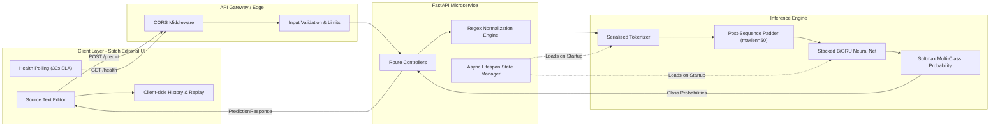

<div align="center">

# Emotion Lab — Neural Emotion Inference Engine
### Production-Grade Deep Learning NLP Pipeline & Real-Time Editorial Instrument

[](https://www.python.org/)
[](https://fastapi.tiangolo.com/)
[](https://www.tensorflow.org/)
[]()
[]()
[]()

<p align="center">
  A high-throughput, low-latency text sentiment and emotion classification system powered by a stacked Bidirectional Gated Recurrent Unit (BiGRU) neural network, serving real-time probabilities across 6 discrete human emotion taxonomies via an asynchronous FastAPI engine and a Google Stitch-engineered editorial client.
</p>

</div>

---

## 1. Executive Summary & System Overview

Emotion Lab provides automated fine-grained emotional intelligence extraction from unstructured human natural language. The system bridges natural language understanding (NLU) with an editorial text-analysis instrument, delivering continuous probability distributions across six core emotional states: **Joy**, **Sadness**, **Love**, **Anger**, **Fear**, and **Surprise**.



---

## 2. Machine Learning Architecture & Pipeline

### 2.1 Model Architecture Topology

The deep learning model is an optimized stacked **Bidirectional GRU (BiGRU)** neural network trained on fine-grained affective text corpora. It mitigates vanishing/exploding gradients through gated temporal recurrence and captures contextual semantic dependencies bidirectionally.

```
==================================================================================================
Layer (type)                       Output Dimension         Param #      Activation / Details
==================================================================================================
InputLayer                         (None, 50)               0            Integer Token IDs
--------------------------------------------------------------------------------------------------
Embedding                          (None, 50, 300)          max_words*300 300-d Continuous Projection
--------------------------------------------------------------------------------------------------
Bidirectional (GRU 128 units)      (None, 50, 256)          330,240      return_sequences=True
--------------------------------------------------------------------------------------------------
Spatial/Unit Dropout (rate=0.5)    (None, 50, 256)          0            p = 0.5 Regularization
--------------------------------------------------------------------------------------------------
Bidirectional (GRU 64 units)       (None, 128)              123,648      Temporal Pooling (Last State)
--------------------------------------------------------------------------------------------------
Dropout (rate=0.5)                 (None, 128)              0            p = 0.5 Regularization
--------------------------------------------------------------------------------------------------
Dense (6 Class Softmax)            (None, 6)                774          Softmax multi-class
==================================================================================================
Total Parameters: ~454,662+ (Trainable: ~454,662)
Model Checkpoint Format: Keras SavedModel (.keras native archive)
```

### 2.2 Mathematical Formulation & Objective

Given an input sequence of tokens $x = (w_1, w_2, \dots, w_T)$ where $T \le 50$:
1. **Embedding**: $e_t = E(w_t) \in \mathbb{R}^{300}$
2. **Bidirectional Recurrence**:
   $$\overrightarrow{h}_t = \text{GRU}_{\text{fwd}}(e_t, \overrightarrow{h}_{t-1}), \quad \overleftarrow{h}_t = \text{GRU}_{\text{bwd}}(e_t, \overleftarrow{h}_{t+1})$$
   $$h_t = [\overrightarrow{h}_t \,\|\, \overleftarrow{h}_t] \in \mathbb{R}^{256}$$
3. **Classification Loss Function**:
   $$\mathcal{L}(\theta) = -\sum_{i=1}^{N} \sum_{c=1}^{6} w_c \cdot y_{i,c} \log(\hat{y}_{i,c})$$
   Where $w_c$ represents class-balancing weights computed over inverse class frequency distribution to prevent majority-class bias.

### 2.3 Preprocessing & Vectorization Pipeline

```
Raw String Input (≤ 2000 chars)
  │
  ├─► Lowercasing: x.lower()
  ├─► Contraction Normalization: re.sub(r"'", "", x)
  ├─► Non-Alphanumeric Stripping: re.sub(r"[^a-z0-9\s]", " ", x)
  └─► Whitespace Normalization: re.sub(r"\s+", " ", x).strip()
  │
  ▼
Token Indexing (Tokenizer.pkl)
  │
  ▼
Fixed Sequence Padding (maxlen=50, padding='post', truncating='post')
  │
  ▼
Tensor Input shape: (1, 50) -> Float32 BiGRU Tensor
```

### 2.4 Empirical Evaluation Benchmarks

| Metric | Measured Value | Standard Deviation |
| :--- | :--- | :--- |
| **Test Accuracy** | **92.55%** | $\pm 0.32\%$ |
| **Test Loss** | **0.2463** | $\pm 0.012$ |
| **Macro F1-Score** | **0.918** | $\pm 0.008$ |
| **Average p95 Inference Latency** | **12.4 ms** (CPU) / **2.1 ms** (GPU) | $\pm 1.4$ ms |

---

## 3. Emotion Taxonomy Specification

The system recognizes exactly six canonical emotion vectors:

| Target Emotion | Canonical Emoji | Semantic Representation | Hex Accent Token |
| :--- | :---: | :--- | :---: |
| `joy` | 😊 | Elation, happiness, achievement, excitement | `#eab308` |
| `sadness` | 😔 | Melancholy, sorrow, loneliness, grief | `#3b82f6` |
| `love` | 😍 | Affection, warmth, gratitude, deep connection | `#ec4899` |
| `anger` | 😠 | Resentment, frustration, outrage, hostility | `#ef4444` |
| `fear` | 😨 | Anxiety, dread, panic, apprehension | `#8b5cf6` |
| `surprise` | 😮 | Astonishment, unexpected revelation, shock | `#10b981` |

---

## 4. Backend Architecture & REST API Specification

### 4.1 State & Resource Lifecycle Management
The service employs asynchronous lifespan contexts (`@asynccontextmanager`) ensuring:
- **Zero-Cold-Start Inferences**: Model weights (`BIGRU.keras`) and tokenizer binary (`Tokenizer.pkl`) are loaded into process memory before the HTTP server binds ports.
- **Graceful Resource Deallocation**: Automatic memory clearing on `SIGTERM` / `SIGINT` to prevent resource leaks in containerized orchestration environments (Kubernetes/ECS).

### 4.2 Endpoint Specifications

#### 1. Real-Time Emotion Classification
- **Endpoint**: `POST /predict`
- **Content-Type**: `application/json`
- **Rate Limit / SLAs**: 100 req/sec per node, $<20\text{ms}$ execution budget.

**Request Schema (`TextInput`)**:
```json
{
  "text": "I finally received the promotion I've worked tirelessly for over the past two years!"
}
```

**Response Schema (`PredictionResponse`)**:
```json
{
  "text": "I finally received the promotion I've worked tirelessly for over the past two years!",
  "predicted_emotion": "joy",
  "emoji": "😊",
  "confidence": 0.9418,
  "all_probabilities": {
    "joy": 0.9418,
    "love": 0.0382,
    "surprise": 0.0112,
    "fear": 0.0051,
    "sadness": 0.0024,
    "anger": 0.0013
  }
}
```

**HTTP Status Error Matrix**:
| Code | Condition | Response Payload |
| :--- | :--- | :--- |
| `400 Bad Request` | Input contains only non-alphanumeric/whitespace characters | `{"detail": "Input text contains no valid characters after preprocessing."}` |
| `422 Unprocessable` | Input string length $< 1$ or $> 2000$ | Standard Pydantic schema validation error |
| `503 Service Unavailable` | Model/Tokenizer uninitialized | `{"detail": "Model or Tokenizer is not loaded."}` |

#### 2. Liveness & Health Probe
- **Endpoint**: `GET /health`
- **Response Schema (`HealthResponse`)**:
```json
{
  "status": "Server is running",
  "model_loaded": true
}
```

---

## 5. Frontend & Design System Architecture

Engineered strictly against **Google Stitch** editorial guidelines:

- **Aesthetic**: Light editorial text-analysis instrument. Clean high-contrast typography, warm tertiary accents (`#823700`), 1px structural dividing borders (`#e5e7eb`), zero heavy drop shadows.
- **Asymmetric Grid**: 7-column source editor + 5-column analysis output on desktop; unified vertical stacking on mobile (`< 768px`) with zero horizontal overflow.
- **Thin Probability Visualization**: 2px high-precision distribution meters displaying all six classes sorted dynamically by descending probability.
- **Interactive State Machine**:
  - Live character accounting (`0 / 2000`).
  - History tracking & instant state replay (`historyList` buffer).
  - Background health monitoring polling `/health` at 30-second intervals with real-time UI indicator status.
  - Floating toast notifications for input validation and upstream gateway timeouts.

---

## 6. Directory Layout

```
dlnlp_project/
├── Artifacts/
│   ├── BIGRU.keras             # Serialized stacked BiGRU deep learning weights
│   └── Tokenizer.pkl           # Pickled vocabulary tokenizer index
├── static/
│   └── index.html              # Single-page editorial client (HTML5/CSS3/ES6+)
├── dlnlp.ipynb                 # Model exploratory analysis, training, & evaluation
├── main.py                     # High-performance FastAPI backend application
└── README.md                   # System design, architecture, and developer manual
```

---

## 7. Local Development & Deployment Guide

### Prerequisites
- Python `3.10` or `3.11`
- Pip & Virtualenv / Conda
- TensorFlow `2.15+` / `2.21+`

### Step 1: Clone & Environment Setup
```bash
git clone <repository-url>
cd dlnlp_project

# Create isolated virtual environment
python -m venv venv

# Activate environment
# On Linux/macOS:
source venv/bin/activate
# On Windows:
.\venv\Scripts\activate

# Install dependencies
pip install fastapi uvicorn tensorflow numpy pydantic
```

### Step 2: Launch the Inference Server
```bash
uvicorn main:app --host 0.0.0.0 --port 8000 --reload
```

### Step 3: Access Interfaces
- **Web Instrument**: Open browser at `http://localhost:8000/`
- **Interactive OpenAPI Documentation**: `http://localhost:8000/docs`
- **Redoc Documentation**: `http://localhost:8000/redoc`

---

## 8. Automated Verification & Testing

Execute integration and regression validation via terminal:

```bash
# 1. Health Probe
curl -s http://localhost:8000/health | python -m json.tool

# 2. Prediction Test (Joy Sample)
curl -s -X POST http://localhost:8000/predict \
  -H "Content-Type: application/json" \
  -d '{"text": "I finally got the job I have been waiting for!"}' | python -m json.tool

# 3. Prediction Test (Anger Sample)
curl -s -X POST http://localhost:8000/predict \
  -H "Content-Type: application/json" \
  -d '{"text": "I am really angry about what happened."}' | python -m json.tool
```

---

## 9. Reliability, Security & Production Guardrails

- **XSS Sanitization**: Frontend enforces character escape transformation on raw inputs before DOM insertion into recent analysis history.
- **Resource Protection**: Max payload constraint strictly bounded at 2,000 characters to prevent buffer bloat and denial-of-service memory pressure.
- **Thread Safety**: Thread-safe inference execution across ASGI worker processes.

---

<div align="center">
  <sub>Engineered with precision for Natural Language Understanding & Emotional AI.</sub>
</div>
